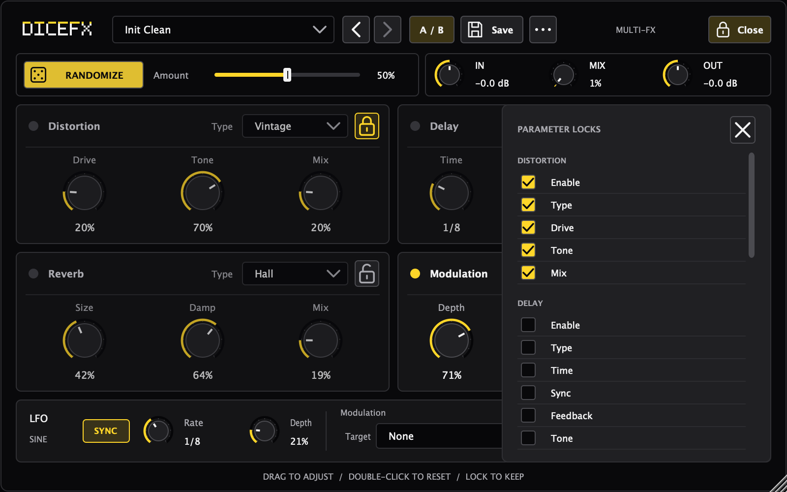

# DiceFX

**Roll a new sound. Keep the parts you like.**

[中文说明](README.zh-CN.md) · [Download](https://github.com/RSK21X/DiceFx/releases/latest) · [What's new](CHANGELOG.md)

DiceFX is a stereo multi-effects VST3 plug-in for sound experiments. Combine distortion, modulation, delay and reverb, then randomize unlocked parameters to explore variations without losing the settings you want to keep.


## What's new in 1.1.0

A smaller, cleaner interface: flat black-and-yellow styling, scalable SVG icons and a tidy 2×2 effects panel. The default window is **800 × 500**, resizable from **720 × 450** to **1120 × 700**. Knobs stay round and controls retain their spacing when resized.

This update changes the interface and documentation, **not the audio-processing code**.

## Download and install

Get the latest build from [GitHub Releases](https://github.com/RSK21X/DiceFx/releases/latest).

| Download | Purpose |
| --- | --- |
| `DiceFX-1.1.0-macOS-universal-VST3.zip` | VST3 plug-in for your DAW |
| `DiceFX-1.1.0-macOS-universal-Standalone.zip` | Standalone app for trying the interface and effects |
| `SHA256SUMS.txt` | Checksums for the release archives |

The release contains Apple Silicon (`arm64`) and Intel (`x86_64`) builds targeting macOS 11 or newer. A VST3-capable host is required for the plug-in. AU, AAX and Windows binaries are not included.

Release checks passed natively on Apple Silicon and for the Intel slice under Rosetta on macOS 27. Older macOS versions and a physical Intel Mac have not been runtime-tested.

1. Quit your DAW and extract the VST3 archive.
2. Put `DiceFX.vst3` in `~/Library/Audio/Plug-Ins/VST3/`.
3. Reopen your DAW, rescan its plug-ins if needed, and load DiceFX on a stereo track.

The standalone app does not need a DAW. Its audio input starts muted to avoid a feedback loop; check its audio settings before enabling input. Without a host tempo, synchronized controls use the processor's 120 BPM fallback.

Release bundles are ad-hoc signed, **not Apple-notarized**. macOS may ask you to approve opening a downloaded build. Use the per-app approval flow only if you trust the download; you do not need to disable system-wide security protections.

## A quick way to use it

1. Start with **Init Clean** or another preset and enable the effects you need using their status lights.
2. Adjust **Amount** for a subtle or stronger randomization.
3. Click a module's **lock** to protect all of its parameters, or open **Locks** to protect individual settings.
4. Press **RANDOMIZE**. Use the back/forward arrows to undo or redo randomization, or **A / B** to compare two sounds.
5. Set the overall **MIX**, then save the result as a preset.

Drag a knob to adjust it; double-click to reset it to its default. A module light switches the effect on or off. Locks protect settings from randomization; they do not prevent manual edits.

## Effects and modulation

The audio chain is **Distortion → Modulation → Delay → Reverb**, with global input gain, dry/wet mix and output gain.

| Section | Types | Controls |
| --- | --- | --- |
| Distortion | Modern · Vintage · Hard | Drive · Tone · Mix |
| Delay | Digital · Tape · PingPong | Time · Sync · Feedback · Tone · Mix |
| Reverb | Room · Hall · Plate | Size · Damp · Mix |
| Modulation | Chorus · Flanger | Depth · Rate · Feedback · Mix |

The global sine LFO has free-rate and tempo-synchronized modes, depth, and **one destination at a time**: None, Dist Drive, Delay Time, Delay Feedback, Reverb Size, Reverb Mix or Mod Depth. The current processor does not support multiple simultaneous LFO destinations or selectable waveforms.

### Parameter locks



Use the module padlock for an entire section. The **Locks** drawer provides individual effect and global input/output/mix locks. A partially locked module has a separate indicator.

### Presets

Four factory presets are embedded: **Init Clean**, **Echo Mist**, **Grain Smash** and **Wide Wash**.

Use **Save** to keep a user preset. The **…** menu includes save, import and export; preset files are JSON. On macOS, this version stores user presets in:

```text
~/Library/DiceFX/Presets/
```

Existing parameter IDs and the audio-processing implementation are retained in this UI update.

## Build from source

Requirements: CMake 3.22+, a C++17 compiler, and Xcode Command Line Tools on macOS. JUCE 8.0.12 is pinned as a Git submodule.

```bash
git clone --recurse-submodules https://github.com/RSK21X/DiceFx.git
cd DiceFx
cmake -S . -B build -DCMAKE_BUILD_TYPE=Release
cmake --build build --config Release --target DiceFX_VST3 -j 4
```

If you already cloned without JUCE, run `git submodule update --init --recursive`.

By default the build copies the VST3 bundle to your user plug-in folder. Set `-DDICEFX_COPY_PLUGIN_AFTER_BUILD=OFF` to build without installing it.

### Universal macOS release

```bash
cmake -S . -B build-release \
  -DCMAKE_BUILD_TYPE=Release \
  -DCMAKE_OSX_ARCHITECTURES="arm64;x86_64" \
  -DCMAKE_OSX_DEPLOYMENT_TARGET=11.0 \
  -DDICEFX_BUILD_PREVIEW=ON \
  -DDICEFX_COPY_PLUGIN_AFTER_BUILD=OFF
cmake --build build-release --config Release \
  --target DiceFX_VST3 DiceFX_Standalone -j 4
```

The bundles are under `build-release/DiceFX_artefacts/Release/VST3/` and `build-release/DiceFX_artefacts/Release/Standalone/`.

### UI and interaction checks

```bash
cmake -S . -B build \
  -DCMAKE_BUILD_TYPE=Release \
  -DDICEFX_BUILD_UI_CHECKS=ON \
  -DDICEFX_COPY_PLUGIN_AFTER_BUILD=OFF
cmake --build build --config Release --target DiceFXUIChecks -j 4
./build/DiceFXUIChecks_artefacts/Release/DiceFXUIChecks ./build/ui-screenshots
```

The checks render the real editor at four sizes and test SVG rendering, circular knobs, non-overlapping controls, parameter bindings, factory presets, locks, randomization, undo/redo, A/B and sync displays. They also check for finite audio output across all factory presets at 44.1/48/96 kHz and 64/512-sample blocks.

## Project map

- `Source/UI/` — theme, controls, layout and randomization history.
- `Source/Dsp/`, `Source/Mod/`, `Source/Random/` — audio effects, LFO and randomizer.
- `Source/Presets/` and `Resources/Presets.json` — preset handling and factory presets.
- `Resources/Icons/` — embedded SVG icons.
- `Tests/UIChecks.cpp` — editor checks and screenshots.
- `external/JUCE/` — pinned framework submodule.

## License

Project code is distributed under [GPL-3.0](LICENSE). JUCE has its own licensing terms; see the licence included in the JUCE submodule.
