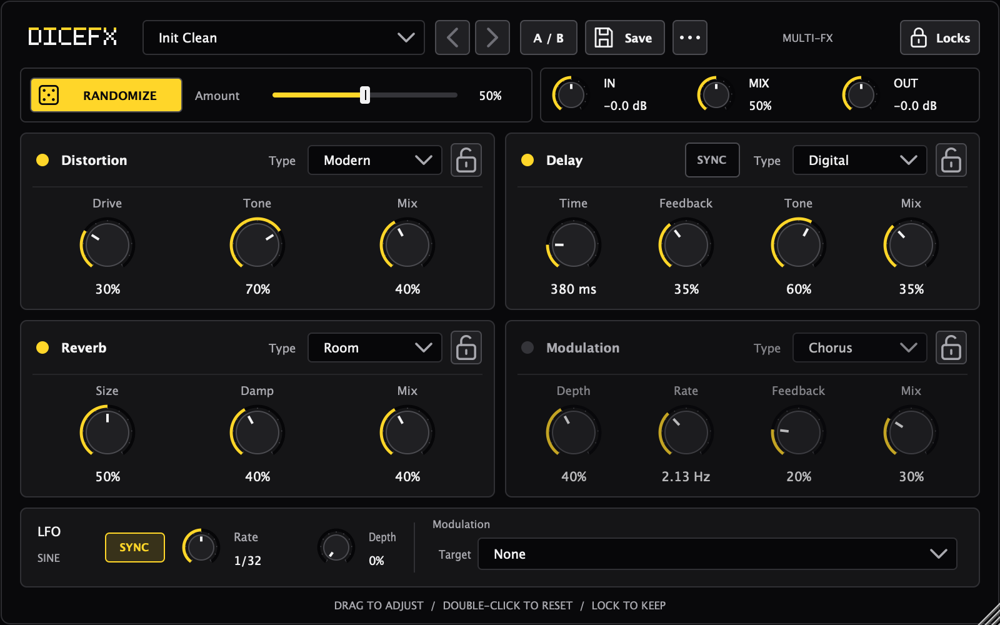

# DiceFX

**掷出新声音，保留喜欢的部分。**

[English](README.md) · [下载 v1.1.1](https://github.com/RSK21X/DiceFx/releases/tag/v1.1.1) · [更新记录](CHANGELOG.md)

紧凑的立体声多效果器插件：失真、调制、延迟、混响，一键随机探索新声音。



## 功能

- 四种效果、可节拍同步的正弦 LFO，以及全局输入／混合／输出。
- 随机化、模块锁和单独参数锁。
- 预设、撤销／重做、A/B 比较。
- 黑黄扁平界面、SVG 图标，默认 800 × 500，可缩放。

**v1.1.1** 修复 DSP 稳定性、时间与立体声一致性，并平滑控制变化。界面和参数 ID 不变。

## 安装

构建目标为 macOS 11+，包含 Apple Silicon 和 Intel 架构；已通过 Apple Silicon 原生及 Rosetta 检查。

- [VST3 插件](https://github.com/RSK21X/DiceFx/releases/download/v1.1.1/DiceFX-1.1.1-macOS-universal-VST3.zip)：退出 DAW，解压后将 `DiceFX.vst3` 放入 `~/Library/Audio/Plug-Ins/VST3/`，重新打开并扫描插件。
- [独立应用](https://github.com/RSK21X/DiceFx/releases/download/v1.1.1/DiceFX-1.1.1-macOS-universal-Standalone.zip)：解压并打开 `DiceFX.app`。为避免反馈，音频输入默认静音。

发布包采用 ad-hoc 签名，未经过 Apple 公证。打开可信下载时，macOS 可能需要你批准。本次不提供 AU、AAX 或 Windows 下载。

## 快速上手

选预设 → 锁定喜欢的参数 → 调整 **Amount** → **RANDOMIZE** → 调整 **MIX** → 保存。前后箭头用于撤销／重做，**A/B** 用于比较，双击旋钮恢复默认值。

## 构建

需要 CMake 3.22+、C++17；macOS 需要 Xcode Command Line Tools。JUCE 已固定为子模块。

```bash
git clone --recurse-submodules https://github.com/RSK21X/DiceFx.git
cd DiceFx
cmake -S . -B build -DCMAKE_BUILD_TYPE=Release -DDICEFX_COPY_PLUGIN_AFTER_BUILD=OFF
cmake --build build --target DiceFX_VST3 -j 4
```

[构建与测试详情](docs/BUILD.md) · [GPL-3.0](LICENSE)
